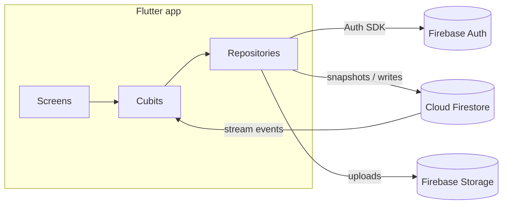

# ALU Nexus — Technical Report

**Connecting ALU students with student-led startups**
Author: D. Muotoh Fra · African Leadership University

---

## 1. Problem statement

ALU students need practical experience before graduating; ALU's student-led
startups need affordable, motivated talent. Today that matching happens
informally through WhatsApp groups and word of mouth — postings get lost,
there is no application record, and students cannot verify that a "startup"
is legitimate. ALU Nexus formalizes this marketplace: verified startups
publish structured internship opportunities, students discover them through
search and skill matching, and both sides track applications through a
transparent pipeline.

## 2. System overview



Three user roles share one codebase:

| Role | Entry point | Capabilities |
|---|---|---|
| Student | `StudentHomeScreen` | discover, bookmark, apply, track applications |
| Startup | `StartupHomeScreen` | register startup, post opportunities, manage applicants |
| Admin | `AdminDashboardScreen` | approve/reject startup verification requests |

## 3. Architecture decisions

### 3.1 Feature-first Clean Architecture

Each feature (auth, opportunities, applications, startups, notifications,
admin) owns three layers:

- **domain** — plain entities (`AppUser`, no Firebase imports), keeping
  business objects testable and framework-independent [1].
- **data** — models that extend the entities and add Firestore
  (de)serialization, plus repositories that own every Firestore/Auth call.
- **presentation** — Cubits and screens. Screens never touch Firebase
  directly; they read Cubit state and dispatch Cubit methods.

This isolation is what makes the app's **demo mode** possible: demo
repositories subclass the production repositories and override their I/O
methods with in-memory data, so the entire UI, routing, and state layer runs
unchanged with or without a Firebase backend — evidence that the layers are
genuinely decoupled.

### 3.2 State management: Cubit (bloc 9.x)

Cubit was chosen over full BLoC events, Provider, and Riverpod:

- **vs. full BLoC** — the app's interactions are direct method calls
  (`search()`, `submitApplication()`); event classes would add ceremony
  without adding auditability we need [2].
- **vs. Provider** — Cubit gives an explicit, sealed state machine
  (`OpportunityInitial → Loading → Loaded | Error`) rather than ad-hoc
  `notifyListeners`, which makes loading/error handling exhaustive at the
  UI layer.
- **vs. Riverpod** — the team is one student; bloc's smaller conceptual
  surface and first-class Flutter integration (`BlocBuilder`,
  `BlocListener`) won on maintainability.

Five Cubits own the app state:

| Cubit | State it controls | Backend link |
|---|---|---|
| `AuthCubit` | session, onboarding completion | `authStateChanges` stream |
| `OpportunityCubit` | feed + active filters | Firestore `snapshots()` |
| `ApplicationCubit` | student/startup application lists | Firestore `snapshots()` |
| `StartupCubit` | directory, detail, verification | Firestore `snapshots()` |
| `NotificationCubit` | notification list + unread count | Firestore `snapshots()` |

One deliberate exception: bookmarks use a lightweight `ChangeNotifier`
singleton (`BookmarkStore`) persisted to `SharedPreferences`. Bookmarks are
device-local personalization, not shared backend state — a full Cubit +
Firestore round-trip would be over-engineering.

### 3.3 Real-time propagation

Every list screen subscribes to Firestore `snapshots()` streams inside its
Cubit. A state-changing write (e.g. a startup updates an application's
status) triggers: Firestore commit → snapshot event → Cubit `emit` →
`BlocBuilder` rebuild — no polling, no manual refresh. The same mechanism
updates the Firebase Console view simultaneously, which is how real-time
synchronization is demonstrated live.

### 3.4 Navigation

`GoRouter` with a `refreshListenable` bound to `AuthCubit`'s stream. Central
`redirect` logic enforces: unauthenticated → `/login`; authenticated but not
onboarded → role-specific onboarding; onboarded → role-specific home. Deep
links can never skip the auth guard because the guard is declarative, not
per-screen.

## 4. Data model (Firestore)

```
users/{uid}                 role, skills[], isOnboardingComplete, ...
startups/{id}               ownerId, verificationStatus, stage, focusAreas[], ...
opportunities/{id}          startupId, startupVerified, skills[], deadline, isActive, ...
applications/{id}           opportunityId, applicantId, status, statusNote, interviewDate, ...
notifications/{id}          userId, type, referenceId, isRead, ...
admin_actions/{id}          adminId, targetId, action, note, timestamp
```

Denormalization is intentional: `opportunities` embeds `startupName` /
`startupVerified`, and `applications` embeds both opportunity and applicant
display fields. This trades write-time duplication for read-time efficiency —
list screens render from a single query with no N+1 joins, which Firestore
pricing and latency strongly favor [3].

Security rules (full text in SETUP.md) enforce: users write only their own
document; only a startup's owner (or an admin) mutates it; only verified
startups' opportunities are publicly queryable; applicants and the receiving
startup are the only readers of an application; admin actions are
admin-only. Auth-domain restriction to ALU emails is validated client-side
and enforceable server-side via the rules' email checks.

## 5. Feature workflows

**Startup verification** — startup completes onboarding →
`verificationStatus: pending` → admin reviews in the dashboard (approve /
reject + note) → decision is written to the startup document *and* logged to
`admin_actions` for auditability → only `approved` startups can publish, and
the feed query filters `startupVerified == true`, so unverified content can
never reach students.

**Application pipeline** — duplicate submissions are blocked by a
pre-submission query; each status change (Reviewing → Shortlisted →
Interviewing → Accepted/Rejected) optionally carries a note and interview
date; students see a step visualization and can withdraw while active.

**Skill matching** — students select skills during onboarding (stored on
`users/{uid}.skills`). The feed scores every active opportunity by case-
insensitive overlap with the student's skills and features the best match
("Matches N of your skills"). This is O(feed × skills) client-side —
appropriate at current scale, with an upgrade path described in §7.

## 6. Error, loading, and edge-case handling

- Every Cubit models `Loading` and `Error` states; screens render shimmer
  placeholders or retryable error panels — no blank screens.
- Firebase Auth error codes are mapped to human-readable messages
  (`email-already-in-use`, `wrong-password`, `too-many-requests`, ...).
- Form validation: ALU email domain, password strength, minimum
  cover-letter length (100 chars), optional-but-validated URLs.
- Duplicate applications rejected with an explanatory snackbar; expired
  opportunities disable the Apply button; deadline proximity is flagged
  ("Closing soon").
- Empty states (no results, no bookmarks, no applications) are explicit
  widgets with guidance text.

## 7. Scalability considerations

- **Query cost** — all list queries are indexed, filtered server-side
  (`isActive`, `startupVerified`, type, commitment), and bounded
  (`limit(50)` on notifications). Text search is client-side over the
  streamed page today; at larger volumes the drop-in replacement is a
  search service (Algolia/Typesense) fed by Firestore triggers [3].
- **Skill matching** — current client-side scoring is O(n·m) per feed load.
  The repository already exposes `getRecommendedOpportunities()` using
  Firestore's `arrayContainsAny`, so ranking can move server-side (Cloud
  Function + composite index) without touching the UI layer.
- **Fan-out notifications** — writing one notification document per
  recipient scales linearly; a Cloud Functions trigger on application
  status change keeps client code unchanged while centralizing fan-out.
- **Team scale** — feature-first foldering means new features (chat,
  analytics) are additive: new folder, new Cubit, new routes; no cross-
  feature edits required.

## 8. Testing & quality

- `flutter analyze`: **0 issues** (deprecations resolved to current
  Material 3 APIs, e.g. `withValues`, `initialValue`, `activeThumbColor`).
- Unit tests cover the validator layer (ALU-domain rules, password policy,
  URL/length validation) — the highest-risk pure logic in the app.
- Demo mode doubles as an integration harness: every screen exercises the
  real Cubit/repository interfaces against deterministic data.

## 9. Limitations & future work

- Push notifications (FCM) are scaffolded but not yet delivered end-to-end.
- Resume/file upload to Firebase Storage is stubbed at the UI level.
- In-app messaging between startups and shortlisted candidates is the next
  highest-value feature per the original brief.

## References

[1] R. C. Martin, *Clean Architecture: A Craftsman's Guide to Software
Structure and Design*. Boston, MA, USA: Prentice Hall, 2017.

[2] F. Angelov, "bloc state management library," bloclibrary.dev, 2024.
[Online]. Available: https://bloclibrary.dev

[3] Google, "Cloud Firestore documentation — Data model, queries, and
pricing," firebase.google.com, 2025. [Online]. Available:
https://firebase.google.com/docs/firestore

[4] Google, "Firebase Authentication documentation," firebase.google.com,
2025. [Online]. Available: https://firebase.google.com/docs/auth

[5] Flutter team, "Flutter documentation," docs.flutter.dev, 2025.
[Online]. Available: https://docs.flutter.dev
